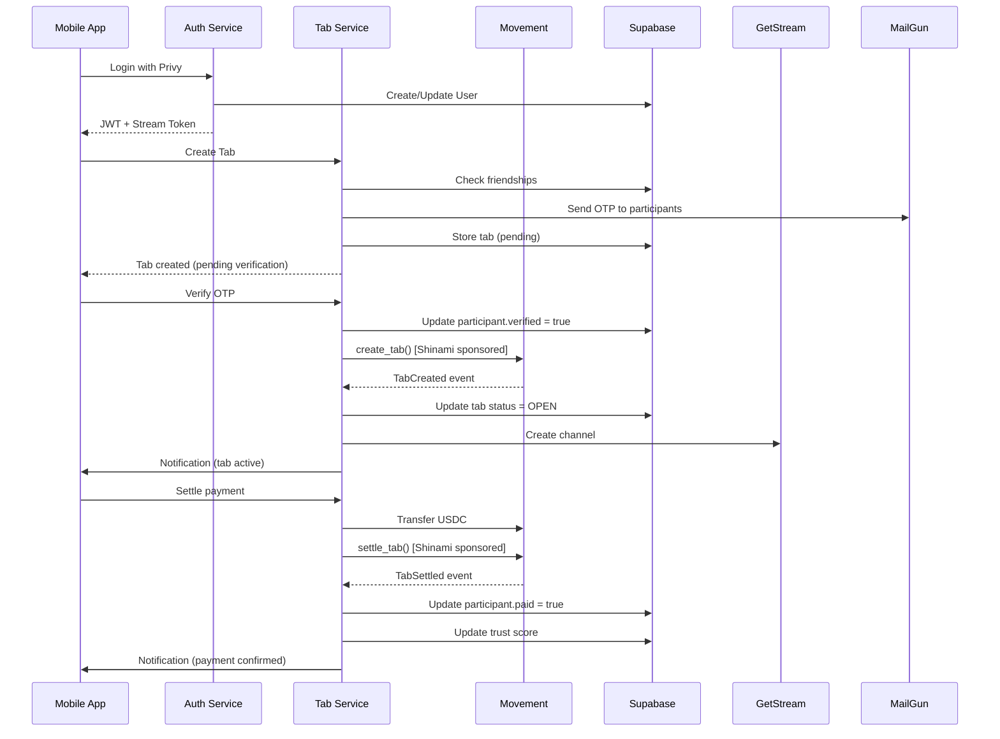

# GhostTab Platform - Complete Technical Documentation

**A Web2.5 Social Payments Platform for Peer-to-Peer Obligations**

[](https://reactnative.dev/)
[](https://expo.dev/)
[](https://movementlabs.xyz/)
[](LICENSE)

---

## Table of Contents

- [Overview](#overview)
- [System Architecture](#system-architecture)
- [Tech Stack](#tech-stack)
- [Backend Services](#backend-services)
- [Mobile Application](#mobile-application)
- [Smart Contracts](#smart-contracts)
- [Integration Workflows](#integration-workflows)
- [API Documentation](#api-documentation)
- [Database Schema](#database-schema)
- [Getting Started](#getting-started)
- [Deployment](#deployment)
- [Security](#security)
- [Roadmap](#roadmap)

---

## Overview

GhostTab is a mobile-first Web2.5 application that bridges social obligations with blockchain settlement guarantees. Built on Movement testnet, GhostTab enables users to create, track, and settle peer-to-peer tabs and group expenses while maintaining the familiar UX of traditional social apps.

The platform employs a hybrid architecture where social interactions and coordination happen offchain (Supabase, GetStream.io), while financial obligations and settlements are recorded onchain (Movement). All blockchain transactions are gas-sponsored by Shinami, delivering a completely gasless experience for end users.

#### GhostTab Backend -> https://github.com/gr4yha7/ghosttab-backend

#### Pitch Deck -> https://www.canva.com/design/DAG995mx2vA/tH2lcYz9NYL4y3P6-14-Nw/view?utm_content=DAG995mx2vA&utm_campaign=designshare&utm_medium=link2&utm_source=uniquelinks&utlId=hf639733f06

### Key Highlights

- 📱 **Native Mobile App** - Built with React Native (Expo 54) and styled with NativeWind
- ⛽ **Zero Gas Fees** - All onchain transactions sponsored by Shinami
- 🔐 **Web2 Authentication** - Email/social login with embedded wallets via Privy
- 🤝 **Social Graph-Based** - Friends-only tabs anchored in real relationships
- 📊 **Reputation System** - Transparent trust scores based on payment behavior
- 💬 **Built-in Messaging** - Group chat powered by GetStream.io
- ⚡ **Instant Settlement** - USDC settlements on Movement with dual-state recording
- 🎯 **Smart Notifications** - Context-aware reminders for tabs and payments
- 🏗️ **Microservices Architecture** - Scalable backend with 6 specialized services

### Problem Statement

Traditional peer-to-peer payment apps face several limitations:

1. **Lack of Obligation Guarantees** - Payments rely on trust without enforcement mechanisms
2. **No Portable Reputation** - Payment history doesn't travel across platforms
3. **Centralized Control** - Single points of failure and data custody concerns
4. **High Settlement Costs** - Traditional payment rails charge 2-3% fees
5. **Poor Social Context** - Payments divorced from the social relationships they represent

Existing crypto solutions often suffer from:

- **Poor UX** - Gas fees, wallet management, and blockchain complexity
- **No Social Layer** - Pure financial primitives without relationship context
- **Aggressive Liquidation** - Forced settlements that damage relationships
- **Lack of Flexibility** - One-size-fits-all approaches to social obligations

### Our Solution

GhostTab combines the best of Web2 and Web3:

**Web2 Experience Layer:**
- Familiar email/social login (Privy)
- Mobile-first React Native interface
- Real-time messaging and notifications
- Offchain data for instant reads (Supabase)
- OTP verification for security (MailGun)

**Web3 Settlement Layer:**
- Onchain obligation recording (Movement)
- USDC settlements with finality guarantees
- Gas-sponsored transactions (Shinami)
- Transparent, immutable payment history
- Optional penalty enforcement

**Social Trust Infrastructure:**
- Friends-only obligation creation
- Public trust scores (pays early/late/on-time)
- Reputation that travels with users
- Nudge-based reminders vs forced liquidation
- Group messaging for coordination

---

## System Architecture

### High-Level Architecture

```
┌─────────────────────────────────────────────────────────────────────┐
│                         Mobile App (Expo)                            │
│  ┌──────────────┐  ┌──────────────┐  ┌──────────────────────────┐  │
│  │ React Native │  │  NativeWind  │  │  Expo Router             │  │
│  │  Components  │  │   Styling    │  │  Navigation              │  │
│  └──────────────┘  └──────────────┘  └──────────────────────────┘  │
└─────────────────────────────────────────────────────────────────────┘
                               │
                               ▼
┌─────────────────────────────────────────────────────────────────────┐
│                      Backend Microservices                           │
│  ┌──────────┐  ┌──────────┐  ┌──────────┐  ┌──────────────────┐   │
│  │   Auth   │  │   User   │  │   Tab    │  │  Notification    │   │
│  │ :3001    │  │  :3002   │  │  :3003   │  │     :3004        │   │
│  └──────────┘  └──────────┘  └──────────┘  └──────────────────┘   │
│  ┌──────────┐  ┌──────────┐                                        │
│  │   Chat   │  │  Common  │                                        │
│  │  :3005   │  │  Package │                                        │
│  └──────────┘  └──────────┘                                        │
└─────────────────────────────────────────────────────────────────────┘
                               │
         ┌─────────────────────┼─────────────────────┐
         ▼                     ▼                     ▼
┌──────────────┐    ┌──────────────────┐    ┌──────────────┐
│   Supabase   │    │ Movement Testnet │    │ GetStream.io │
│   Database   │◄───┤  Smart Contracts │───►│  Chat Server │
│              │    │                  │    │              │
│  - Users     │    │  - TabManager    │    │  - Channels  │
│  - Friends   │    │  - Settlement    │    │  - Messages  │
│  - Groups    │    │  - USDC Transfers│    │  - Threads   │
│  - Tabs      │    │                  │    │              │
└──────────────┘    └──────────────────┘    └──────────────┘
         │                     │                     │
         └─────────────────────┴─────────────────────┘
                               │
                    ┌──────────┴──────────┐
                    ▼                     ▼
              ┌──────────┐          ┌──────────┐
              │  Privy   │          │ Shinami  │
              │   Auth   │          │   Gas    │
              │  Wallets │          │ Sponsor  │
              └──────────┘          └──────────┘
```

### Monorepo Structure

```
ghosttab-backend/                    # Backend monorepo (Turborepo)
├── move_contract/                   # Movement smart contracts
│   ├── sources/
│   │   └── tab_manager.move        # Core tab & settlement logic
│   ├── scripts/                     # Deployment scripts
│   └── tests/                       # Move tests
├── packages/
│   ├── common/                      # Shared utilities & types
│   │   ├── src/
│   │   │   ├── config/             # Shared configuration
│   │   │   ├── middleware/         # Auth, error handling
│   │   │   ├── types/              # TypeScript interfaces
│   │   │   └── utils/              # Logger, validators
│   │   └── package.json
│   ├── auth-service/                # Port 3001
│   │   ├── src/
│   │   │   ├── controllers/
│   │   │   ├── services/
│   │   │   └── routes/
│   │   └── package.json
│   ├── user-service/                # Port 3002
│   │   ├── src/
│   │   │   ├── controllers/
│   │   │   ├── services/
│   │   │   │   ├── user.service.ts
│   │   │   │   ├── friend.service.ts
│   │   │   │   └── group.service.ts
│   │   │   └── routes/
│   │   └── package.json
│   ├── tab-service/                 # Port 3003
│   │   ├── src/
│   │   │   ├── controllers/
│   │   │   ├── services/
│   │   │   │   ├── tab.service.ts
│   │   │   │   ├── blockchain.service.ts
│   │   │   │   ├── otp.service.ts
│   │   │   │   └── trustscore.service.ts
│   │   │   └── routes/
│   │   └── package.json
│   ├── notification-service/        # Port 3004
│   │   └── src/
│   │       ├── services/
│   │       └── websocket/
│   └── chat-service/                # Port 3005
│       └── src/
│           └── services/
├── supabase/
│   └── migrations/                  # Database migrations
├── docker-compose.yml
├── turbo.json
└── package.json

ghosttab/                            # Mobile app (Expo)
├── app/                             # Expo Router screens
│   ├── (tabs)/                      # Main app tabs
│   │   ├── home.tsx
│   │   ├── friends.tsx
│   │   ├── groups.tsx
│   │   └── profile.tsx
│   ├── onboarding.tsx
│   ├── create.tsx                   # Create tab
│   ├── detail.tsx                   # Tab details
│   ├── settle.tsx                   # Settlement screen
│   ├── accept-invite.tsx            # OTP verification
│   ├── chat.tsx                     # Tab chat
│   ├── notifications.tsx
│   └── _layout.tsx
├── components/
│   ├── Button.tsx
│   ├── TabCard.tsx
│   ├── UserAvatar.tsx
│   └── TrustScoreBadge.tsx
├── context/
│   ├── AuthContext.tsx
│   ├── NotificationContext.tsx
│   └── TabContext.tsx
├── services/
│   ├── api.ts                       # Backend API client
│   ├── notifications.ts
│   └── websocket.ts
├── hooks/
│   ├── useAuth.ts
│   └── useTabs.ts
├── app.config.js
├── tailwind.config.js
└── package.json
```

---

## Tech Stack

### Mobile App (Frontend)

| Technology | Version | Purpose |
|------------|---------|---------|
| **React Native** | 0.81.4 | Cross-platform mobile framework |
| **Expo** | SDK 54 | Development platform & build tools |
| **NativeWind** | 4.2.1 | Tailwind CSS for React Native |
| **Expo Router** | 6.0.8 | File-based navigation |
| **TypeScript** | 5.9.2 | Type safety |
| **TanStack Query** | 5.90.16 | Server state & caching |
| **Privy Expo SDK** | 0.59.6 | Embedded wallets & authentication |
| **Viem** | 2.38.3 | Ethereum/Movement interactions |
| **Axios** | 1.13.2 | HTTP client |

### Backend Services

| Technology | Version | Purpose |
|------------|---------|---------|
| **Node.js** | 20+ | Runtime environment |
| **Express.js** | Latest | Web framework |
| **TypeScript** | 5.3.3 | Type safety |
| **Turborepo** | 1.13.4 | Monorepo build system |
| **Supabase** | Latest | PostgreSQL database with realtime |
| **Redis** | Latest | Pub/Sub for notifications |
| **Privy** | Latest | Authentication & wallet management |
| **GetStream** | Latest | Chat & messaging |
| **MailGun** | Latest | Email delivery (OTP) |

### Blockchain & Infrastructure

| Technology | Purpose |
|------------|---------|
| **Movement Testnet** | L2 execution layer (MoveVM) |
| **USDC** | Settlement currency |
| **Shinami** | Gas sponsorship service |
| **Aptos SDK** | Movement blockchain interactions |

---

## Backend Services

### 1. Auth Service (Port 3001)

**Responsibilities:**
- Privy token verification
- JWT generation for backend authentication
- GetStream token generation for chat
- User session management

**Key Endpoints:**
```typescript
POST   /auth/login           // Login with Privy token
GET    /auth/me              // Get current user
POST   /auth/refresh         // Refresh JWT token
```

**Authentication Flow:**
```
1. User logs in via Privy (mobile app)
2. Mobile app receives Privy token
3. App sends Privy token to /auth/login
4. Auth service verifies with Privy
5. Creates/updates user in Supabase
6. Generates JWT + GetStream token
7. Returns tokens to mobile app
```

---

### 2. User Service (Port 3002)

**Responsibilities:**
- User profile management
- Friend request system
- Group management
- Trust score calculation and display

**Key Features:**

#### Friend Management
```typescript
// Send friend request
POST /users/friends/request
{
  "toIdentifier": "email@example.com" // or username
}

// Accept/decline requests
POST   /users/friends/:friendshipId/accept
DELETE /users/friends/:friendshipId/decline

// Get friends list
GET /users/friends?status=ACCEPTED
```

#### Group Management
```typescript
// Create group
POST /users/groups
{
  "name": "Roommates",
  "description": "Monthly expenses",
  "icon": "🏠",
  "memberIds": ["user1", "user2"]
}

// Get user's groups
GET /users/groups

// Update group
PATCH /users/groups/:groupId

// Add/remove members
POST   /users/groups/:groupId/members
DELETE /users/groups/:groupId/members/:userId
```

#### Trust Score System
```typescript
interface TrustTier {
  tier: 'Excellent' | 'Good' | 'Fair' | 'Poor';
  label: string;
  color: string;
  benefits: string[];
}

// Trust score calculation
- Excellent (80-100): "Settles instantly" - Green
- Good (60-79): "Reliable payer" - Blue
- Fair (40-59): "Sometimes late" - Yellow
- Poor (0-39): "Often late" - Red
```

---

### 3. Tab Service (Port 3003)

**Responsibilities:**
- Tab creation (personal & group)
- OTP verification for tab participants
- Settlement verification
- Blockchain interaction via Movement
- Trust score updates after settlements

**Key Features:**

#### Tab Creation Flow
```typescript
// Create personal tab
POST /tabs
{
  "title": "Dinner at Restaurant",
  "description": "Split dinner bill",
  "category": "DINING",
  "totalAmount": 120.50,
  "participants": [
    { "userId": "user1", "shareAmount": 60.25 },
    { "userId": "user2", "shareAmount": 60.25 }
  ],
  "settlementDeadline": "2026-01-20T00:00:00Z",
  "penaltyRate": 5.0,
  "settlementWallet": "0x..."
}

// Create group tab
POST /tabs/group/:groupId
{
  "title": "Monthly Rent",
  "totalAmount": 2000,
  "category": "ACCOMMODATION",
  // Automatically splits among group members
}
```

#### OTP Verification System
```typescript
// After tab creation, participants receive OTP via email
// They must verify to join the tab

POST /tabs/:tabId/verify
{
  "otpCode": "123456",
  "accept": true  // or false to decline
}

// Resend OTP
POST /tabs/:tabId/resend-otp
```

#### Settlement Flow
```typescript
// Settle payment
POST /tabs/:tabId/settle
{
  "txHash": "0xabc...",  // Movement transaction hash
  "amount": 60.25
}

// Backend verifies:
// 1. Transaction exists on Movement
// 2. Amount matches participant's share
// 3. USDC transferred to settlement wallet
// 4. Updates participant status
// 5. Recalculates trust score
// 6. Sends notifications
```

#### Blockchain Integration
```typescript
// Get USDC balance from Movement
GET /tabs/balance/:walletAddress

// Uses dual-fallback system:
// 1. Primary: Movement Indexer API
// 2. Fallback: Direct view function call
//    0x1::primary_fungible_store::balance
```

---

### 4. Notification Service (Port 3004)

**Responsibilities:**
- Real-time notifications via WebSocket/SSE
- In-app notification management
- Push notification coordination

**Notification Types:**
```typescript
enum NotificationType {
  TAB_CREATED = 'TAB_CREATED',
  TAB_INVITE = 'TAB_INVITE',
  PAYMENT_RECEIVED = 'PAYMENT_RECEIVED',
  PAYMENT_DUE_SOON = 'PAYMENT_DUE_SOON',
  PAYMENT_OVERDUE = 'PAYMENT_OVERDUE',
  FRIEND_REQUEST = 'FRIEND_REQUEST',
  FRIEND_ACCEPTED = 'FRIEND_ACCEPTED',
  TRUST_SCORE_UPDATED = 'TRUST_SCORE_UPDATED',
}
```

**WebSocket Connection:**
```typescript
// Connect to notification stream
ws://localhost:3004/notifications?token=<jwt>

// Receive real-time updates
{
  "type": "TAB_CREATED",
  "title": "New Tab",
  "body": "John added you to 'Dinner Split'",
  "data": {
    "tabId": "uuid",
    "creatorId": "user1"
  }
}
```

---

### 5. Chat Service (Port 3005)

**Responsibilities:**
- GetStream channel management
- Automatic channel creation for tabs
- User token generation

**Integration:**
```typescript
// Create channel for tab
POST /chat/channels
{
  "tabId": "uuid",
  "memberIds": ["user1", "user2", "user3"]
}

// GetStream channel created with:
// - channelId: tab.streamChannelId
// - channelType: "messaging"
// - members: all tab participants
```

---

### 6. Common Package

**Shared utilities across all services:**

```typescript
// Middleware
- authMiddleware: JWT verification
- errorHandler: Centralized error handling
- rateLimiter: Request rate limiting

// Types
- User, Tab, Friendship, Group interfaces
- Enums: TabStatus, FriendshipStatus, TabCategory

// Utils
- logger: Winston-based logging
- validators: Zod schemas
- publishNotification: Redis pub/sub helper

// Config
- Supabase client
- Redis client
- Environment variables
```

---

## Mobile Application

### Architecture

The mobile app follows a feature-based architecture with clear separation of concerns:

```
Mobile App Architecture
├── Presentation Layer (app/)
│   ├── Screens (Expo Router)
│   └── Components (UI)
├── Business Logic Layer
│   ├── Context (Global state)
│   ├── Hooks (Reusable logic)
│   └── Services (API clients)
└── Data Layer
    ├── API Service (Backend communication)
    └── Local Storage (AsyncStorage)
```

### Key Screens

#### 1. Onboarding (`app/onboarding.tsx`)
- Privy authentication integration
- Email/social login
- Automatic wallet creation
- Username setup

#### 2. Home (`app/(tabs)/home.tsx`)
- Active tabs list
- Quick actions (Create tab, Settle)
- Recent activity feed
- Trust score display

#### 3. Create Tab (`app/create.tsx`)
- Friend selection
- Amount input with smart splitting
- Category selection
- Deadline & penalty configuration
- Settlement wallet setup

#### 4. Tab Detail (`app/detail.tsx`)
- Tab information
- Participant list with payment status
- Settlement deadline countdown
- Chat button (opens tab-specific chat)
- Settle button (if user hasn't paid)

#### 5. Settlement (`app/settle.tsx`)
- Amount breakdown (principal + penalty)
- USDC balance check
- Transaction signing via Privy
- Gas sponsorship via Shinami
- Transaction confirmation

#### 6. Accept Invite (`app/accept-invite.tsx`)
- OTP input screen
- Tab details preview
- Accept/Decline actions
- Deadline for verification

#### 7. Chat (`app/chat.tsx`)
- GetStream integration
- Tab-specific messaging
- File attachments
- Read receipts

### Core Components

#### TrustScoreBadge
```tsx
<TrustScoreBadge
  score={85}
  tier="Excellent"
  showLabel={true}
/>
// Displays color-coded badge with tier
```

#### TabCard
```tsx
<TabCard
  tab={tabData}
  onPress={() => router.push(`/detail?id=${tab.id}`)}
/>
// Shows tab summary with status, amount, deadline
```

#### UserAvatar
```tsx
<UserAvatar
  user={userData}
  size="medium"
  showTrustBadge={true}
/>
// User avatar with optional trust score indicator
```

### State Management

#### AuthContext
```typescript
const { user, login, logout, isAuthenticated } = useAuth();

// Provides:
// - Privy authentication state
// - User profile data
// - JWT token management
// - Auto-refresh logic
```

#### NotificationContext
```typescript
const { notifications, unreadCount, markAsRead } = useNotifications();

// Provides:
// - Real-time notification stream
// - Unread count
// - Notification actions
```

### API Integration

The mobile app communicates with backend services through a centralized API client:

```typescript
// services/api.ts

// Authentication
await api.auth.login(privyToken);
await api.auth.getMe();

// Tabs
await api.tabs.create(tabData);
await api.tabs.getById(tabId);
await api.tabs.settle(tabId, { txHash, amount });

// Users
await api.users.searchUsers(query);
await api.users.sendFriendRequest(email);
await api.users.getGroups();

// Notifications
await api.notifications.getAll();
await api.notifications.markAsRead(notificationId);
```

---

## Smart Contracts

### Movement Contract (`tab_manager.move`)

**Location:** `ghosttab-backend/move_contract/sources/tab_manager.move`

**Core Functionality:**

#### 1. Tab Creation
```move
public entry fun create_tab(
    account: &signer,
    participants: vector<address>,
    share_amounts: vector<u64>,
    settlement_deadline: u64,
    penalty_rate: u64,
    settler_wallet: address
)
```

**Features:**
- Records tab onchain with immutable participant list
- Stores share amounts and settlement deadline
- Configurable penalty rate (basis points)
- Emits `TabCreated` event

#### 2. Settlement
```move
public entry fun settle_tab(
    account: &signer,
    tab_id: u64,
    amount: u64
)
```

**Features:**
- Verifies participant membership
- Calculates penalties based on current time vs deadline
- Transfers USDC from payer to settler wallet
- Updates settlement status
- Emits `TabSettled` event

**Penalty Calculation:**
```move
let penalty = 0u64;
if (current_time > tab.settlement_deadline && tab.penalty_rate > 0) {
    let days_late = (current_time - tab.settlement_deadline) / 86400;
    penalty = (member.share_amount * tab.penalty_rate * days_late) / 10000;
};

let total_payment = amount + penalty;
```

#### 3. USDC Transfer
```move
primary_fungible_store::transfer(
    account,
    registry.usdc_metadata,
    tab.settler_wallet,
    total_payment
);
```

**Contract Events:**
```move
struct TabCreated has drop, store {
    tab_id: u64,
    creator: address,
    participants: vector<address>,
    total_amount: u64,
    deadline: u64,
}

struct TabSettled has drop, store {
    tab_id: u64,
    participant: address,
    amount_paid: u64,
    penalty: u64,
    timestamp: u64,
}
```

---

## Integration Workflows

### Complete Tab Creation & Settlement Flow



### Authentication Flow

```
┌─────────────┐
│ Mobile App  │
└──────┬──────┘
       │ 1. User clicks "Login"
       ▼
┌─────────────────┐
│  Privy SDK      │
│  - Email/Social │
│  - Create Wallet│
└──────┬──────────┘
       │ 2. Privy Token
       ▼
┌─────────────────┐
│  Auth Service   │
│  - Verify Token │
│  - Generate JWT │
└──────┬──────────┘
       │ 3. JWT + Stream Token
       ▼
┌─────────────────┐
│  Mobile App     │
│  - Store Tokens │
│  - Navigate Home│
└─────────────────┘
```

### Settlement Flow with Gas Sponsorship

```
┌─────────────┐
│ User        │
└──────┬──────┘
       │ 1. Click "Settle"
       ▼
┌─────────────────────┐
│  Mobile App         │
│  - Check USDC bal   │
│  - Build USDC tx    │
│  - Sign with Privy  │
└──────┬──────────────┘
       │ 2. Signed USDC transfer
       ▼
┌─────────────────────┐
│  Tab Service        │
│  - Verify signature │
│  - Build settle tx  │
└──────┬──────────────┘
       │ 3. Transaction + Signature
       ▼
┌─────────────────────┐
│  Shinami Gas        │
│  - Sponsor gas      │
│  - Submit to chain  │
└──────┬──────────────┘
       │ 4. Transaction hash
       ▼
┌─────────────────────┐
│  Movement Network   │
│  - Execute settle   │
│  - Emit event       │
└──────┬──────────────┘
       │ 5. Event
       ▼
┌─────────────────────┐
│  Tab Service        │
│  - Update Supabase  │
│  - Update trust     │
│  - Send notification│
└─────────────────────┘
```

---

## API Documentation

### Base URLs

```
Backend Services:
- Auth:         http://localhost:3001
- User:         http://localhost:3002
- Tab:          http://localhost:3003
- Notification: http://localhost:3004
- Chat:         http://localhost:3005

Production:
- Backend: https://api.ghosttab.xyz
```

### Authentication

All endpoints (except `/auth/login`) require JWT authentication:

```
Authorization: Bearer <jwt_token>
```

### Auth Service Endpoints

#### POST `/auth/login`
Login with Privy token

**Request:**
```json
{
  "privyToken": "eyJhbGc..."
}
```

**Response:**
```json
{
  "success": true,
  "data": {
    "user": {
      "id": "user_123",
      "walletAddress": "0xabc...",
      "email": "user@example.com",
      "trustScore": 85
    },
    "streamToken": "stream_token_xyz",
    "isNewUser": false
  }
}
```

---

### User Service Endpoints

#### GET `/users/profile`
Get current user profile

**Response:**
```json
{
  "id": "user_123",
  "walletAddress": "0xabc...",
  "username": "john_doe",
  "email": "john@example.com",
  "avatarUrl": "https://...",
  "trustScore": 85,
  "settlementsOnTime": 15,
  "settlementsLate": 2,
  "totalSettlements": 17
}
```

#### POST `/users/friends/request`
Send friend request

**Request:**
```json
{
  "toIdentifier": "jane@example.com"
}
```

**Response:**
```json
{
  "success": true,
  "data": {
    "friendRequestId": "req_456"
  }
}
```

#### GET `/users/groups`
Get all user groups

**Response:**
```json
{
  "data": [
    {
      "id": "group_789",
      "name": "Roommates",
      "description": "Monthly expenses",
      "icon": "🏠",
      "memberCount": 4,
      "role": "CREATOR",
      "members": [...]
    }
  ]
}
```

---

### Tab Service Endpoints

#### POST `/tabs`
Create new tab

**Request:**
```json
{
  "title": "Dinner at Restaurant",
  "description": "Split dinner bill",
  "category": "DINING",
  "totalAmount": 120.50,
  "participants": [
    { "userId": "user1", "shareAmount": 60.25 },
    { "userId": "user2", "shareAmount": 60.25 }
  ],
  "settlementDeadline": "2026-01-20T00:00:00Z",
  "penaltyRate": 5.0,
  "settlementWallet": "0x..."
}
```

**Response:**
```json
{
  "success": true,
  "data": {
    "id": "tab_abc",
    "status": "OPEN",
    "streamChannelId": "tab_abc_channel",
    "participants": [...]
  }
}
```

#### GET `/tabs/:tabId`
Get tab details

**Response:**
```json
{
  "id": "tab_abc",
  "title": "Dinner at Restaurant",
  "totalAmount": "120.50",
  "status": "OPEN",
  "creator": {...},
  "participants": [
    {
      "userId": "user1",
      "user": {...},
      "shareAmount": "60.25",
      "paid": true,
      "paidAt": "2026-01-15T10:30:00Z",
      "txHash": "0xdef..."
    },
    {
      "userId": "user2",
      "user": {...},
      "shareAmount": "60.25",
      "paid": false,
      "verified": true
    }
  ],
  "summary": {
    "totalPaid": "60.25",
    "remaining": "60.25",
    "allSettled": false
  }
}
```

#### POST `/tabs/:tabId/settle`
Settle payment

**Request:**
```json
{
  "txHash": "0xabc123...",
  "amount": 60.25
}
```

**Response:**
```json
{
  "success": true,
  "message": "Payment verified and recorded"
}
```

#### GET `/tabs/balance/:walletAddress`
Get USDC balance from Movement

**Response:**
```json
{
  "balance": "1250.50",
  "source": "indexer"  // or "view_function"
}
```

---

## Database Schema

### Core Tables

#### users
```sql
CREATE TABLE users (
  id TEXT PRIMARY KEY,
  wallet_address TEXT UNIQUE NOT NULL,
  username TEXT,
  email TEXT UNIQUE,
  phone TEXT,
  avatar_url TEXT,
  auto_settle BOOLEAN DEFAULT false,
  vault_address TEXT,
  stream_token TEXT,
  trust_score INTEGER DEFAULT 100,
  settlements_on_time INTEGER DEFAULT 0,
  settlements_late INTEGER DEFAULT 0,
  total_settlements INTEGER DEFAULT 0,
  avg_settlement_days NUMERIC,
  created_at TIMESTAMPTZ DEFAULT NOW(),
  updated_at TIMESTAMPTZ DEFAULT NOW()
);
```

#### tabs
```sql
CREATE TABLE tabs (
  id UUID PRIMARY KEY DEFAULT uuid_generate_v4(),
  title TEXT NOT NULL,
  description TEXT,
  total_amount NUMERIC NOT NULL CHECK (total_amount > 0),
  currency TEXT DEFAULT 'MOVE',
  status tab_status DEFAULT 'OPEN',
  category tab_category DEFAULT 'OTHER',
  stream_channel_id TEXT UNIQUE,
  settlement_deadline TIMESTAMPTZ,
  penalty_rate NUMERIC DEFAULT 5.00,
  auto_settle_enabled BOOLEAN DEFAULT false,
  settlement_wallet TEXT NOT NULL,
  creator_id TEXT NOT NULL REFERENCES users(id),
  group_id UUID REFERENCES user_groups(id),
  created_at TIMESTAMPTZ DEFAULT NOW(),
  updated_at TIMESTAMPTZ DEFAULT NOW()
);
```

#### tab_participants
```sql
CREATE TABLE tab_participants (
  id UUID PRIMARY KEY DEFAULT uuid_generate_v4(),
  tab_id UUID REFERENCES tabs(id),
  user_id TEXT NOT NULL REFERENCES users(id),
  share_amount NUMERIC NOT NULL CHECK (share_amount >= 0),
  paid BOOLEAN DEFAULT false,
  paid_amount NUMERIC DEFAULT 0,
  paid_tx_hash TEXT,
  paid_at TIMESTAMPTZ,
  settled_early BOOLEAN DEFAULT false,
  days_late INTEGER DEFAULT 0,
  penalty_amount NUMERIC DEFAULT 0,
  final_amount NUMERIC,
  verified BOOLEAN DEFAULT false,
  otp_sent_at TIMESTAMPTZ,
  verification_deadline TIMESTAMPTZ,
  last_reminder_sent_at TIMESTAMPTZ,
  reminder_count INTEGER DEFAULT 0,
  created_at TIMESTAMPTZ DEFAULT NOW(),
  updated_at TIMESTAMPTZ DEFAULT NOW()
);
```

#### friendships
```sql
CREATE TABLE friendships (
  id UUID PRIMARY KEY DEFAULT uuid_generate_v4(),
  user_id TEXT NOT NULL REFERENCES users(id),
  friend_id TEXT NOT NULL REFERENCES users(id),
  status friendship_status DEFAULT 'PENDING',
  created_at TIMESTAMPTZ DEFAULT NOW(),
  updated_at TIMESTAMPTZ DEFAULT NOW()
);
```

#### user_groups
```sql
CREATE TABLE user_groups (
  id UUID PRIMARY KEY DEFAULT uuid_generate_v4(),
  name TEXT NOT NULL,
  description TEXT,
  icon TEXT,
  stream_channel_id TEXT UNIQUE,
  creator_id TEXT NOT NULL REFERENCES users(id),
  created_at TIMESTAMPTZ DEFAULT NOW(),
  updated_at TIMESTAMPTZ DEFAULT NOW()
);
```

#### group_members
```sql
CREATE TABLE group_members (
  id UUID PRIMARY KEY DEFAULT uuid_generate_v4(),
  group_id UUID NOT NULL REFERENCES user_groups(id),
  user_id TEXT NOT NULL REFERENCES users(id),
  role group_role NOT NULL DEFAULT 'MEMBER',
  joined_at TIMESTAMPTZ DEFAULT NOW()
);
```

### Enums

```sql
CREATE TYPE tab_status AS ENUM ('OPEN', 'SETTLED', 'CANCELLED');
CREATE TYPE tab_category AS ENUM (
  'DINING', 'TRAVEL', 'ENTERTAINMENT', 'UTILITIES',
  'GROCERIES', 'TRANSPORTATION', 'ACCOMMODATION', 'OTHER'
);
CREATE TYPE friendship_status AS ENUM ('PENDING', 'ACCEPTED', 'BLOCKED');
CREATE TYPE group_role AS ENUM ('CREATOR', 'ADMIN', 'MEMBER');
```

---

## Getting Started

### Prerequisites

**Backend:**
- Node.js 20+
- Docker & Docker Compose
- Supabase account
- Privy account
- GetStream account
- MailGun account
- Shinami account
- Movement Network RPC access

**Mobile:**
- Node.js 18+
- Expo CLI
- iOS Simulator (macOS) or Android Emulator
- Physical device with Expo Go (optional)

---

### Backend Setup

#### 1. Clone and Install

```bash
git clone <repository>
cd ghosttab-backend

# Automated setup (recommended)
chmod +x setup.sh
./setup.sh

# OR manual setup
npm install
cd packages/common && npm run build && cd ../..
npm install --workspaces
```

#### 2. Environment Configuration

```bash
cp .env.example .env
```

Edit `.env`:

```env
# Privy
PRIVY_APP_ID=your_privy_app_id
PRIVY_APP_SECRET=your_privy_app_secret
PRIVY_VERIFICATION_KEY=your_privy_verification_key

# Supabase
SUPABASE_URL=https://your-project.supabase.co
SUPABASE_SERVICE_KEY=your_supabase_service_key

# Redis
REDIS_URL=redis://localhost:6379

# GetStream
STREAM_API_KEY=your_stream_api_key
STREAM_API_SECRET=your_stream_api_secret

# Movement
MOVEMENT_RPC_URL=https://mevm.testnet.movementlabs.xyz
MOVEMENT_CHAIN_ID=30732
MOVEMENT_USDC_ADDRESS=0xb89077cfd2a82a0c1450534d49cfd5f2707643155273069bc23a912bcfefdee7

# MailGun
MAILGUN_API_KEY=your_mailgun_api_key
MAILGUN_SANDBOX_DOMAIN=your_mailgun_sandbox_domain

# Shinami
GAS_STATION_ACCESS_KEY=your_shinami_gas_station_access_key

# Service Ports
AUTH_SERVICE_PORT=3001
USER_SERVICE_PORT=3002
TAB_SERVICE_PORT=3003
NOTIFICATION_SERVICE_PORT=3004
CHAT_SERVICE_PORT=3005
```

#### 3. Database Setup

```bash
# Login to Supabase
supabase login

# Link project
supabase link --project-ref <your-project-ref>

# Run migrations
supabase db push
```

#### 4. Start Services

```bash
# Start Redis
docker-compose up -d redis

# Start all services
npm run dev

# OR start specific service
npm run dev --workspace=@ghosttab/tab-service
```

**Services will be available at:**
- Auth: http://localhost:3001
- User: http://localhost:3002
- Tab: http://localhost:3003
- Notification: http://localhost:3004
- Chat: http://localhost:3005

---

### Mobile App Setup

#### 1. Install Dependencies

```bash
cd ghosttab
npm install
```

#### 2. Environment Configuration

Create `.env`:

```env
PRIVY_APP_ID=your_privy_app_id
PRIVY_CLIENT_ID=your_privy_client_id
```

#### 3. Run the App

```bash
# Start Expo dev server
npx expo start --reset-cache

# Run on iOS
npx expo start --ios

# Run on Android
npx expo start --android

# Or scan QR code with Expo Go
```

---

### Smart Contract Deployment

```bash
cd ghosttab-backend/move_contract

# Build contract
movement move build

# Deploy to Movement testnet
movement move publish \
  --network testnet \
  --private-key <your-private-key>

# Note the deployed contract address
# Update MOVEMENT_CONTRACT_ADDRESS in .env
```

---

## Deployment

### Backend Deployment (Railway/Render)

#### 1. Build Docker Images

```bash
docker-compose -f docker-compose.prod.yml build
```

#### 2. Deploy to Railway

```bash
# Install Railway CLI
npm install -g @railway/cli

# Login
railway login

# Create project
railway init

# Deploy
railway up
```

#### 3. Environment Variables

Set all environment variables in Railway dashboard matching your `.env` file.

---

### Mobile App Deployment

#### iOS

```bash
# Configure EAS
eas build:configure

# Build for iOS
eas build --platform ios --profile production

# Submit to App Store
eas submit --platform ios
```

#### Android

```bash
# Build for Android
eas build --platform android --profile production

# Submit to Play Store
eas submit --platform android
```

---

## Security

### Current Status

⚠️ **GhostTab is in active development on testnet**

- Smart contracts are **NOT audited**
- Use **testnet funds only**
- **Do not** use real money

### Security Features

**Backend:**
- JWT authentication on all endpoints
- Row Level Security (RLS) on Supabase
- Rate limiting (100 requests per 15 minutes)
- Helmet.js for HTTP security headers
- CORS configured for allowed origins only
- Input validation with Zod schemas

**Mobile:**
- Privy embedded wallets (non-custodial)
- Secure storage for tokens (Expo SecureStore)
- HTTPS-only API communication
- No private keys stored on device

**Smart Contracts:**
- Penalty caps to prevent excessive charges
- Participant verification before settlement
- Immutable tab records
- Event emission for transparency

### Reporting Vulnerabilities

If you discover a security issue:

1. **Do not** open a public issue
2. Email: gr4yha7@protonmail.com
3. Include:
   - Description of vulnerability
   - Steps to reproduce
   - Potential impact
   - Suggested fix (if any)

Response within 48 hours.

---

## Roadmap

### Phase 1: Testnet Launch ✅ (Current)

- [x] Core tab creation and settlement
- [x] Friends management
- [x] Group functionality
- [x] Messaging functionality for tab members
- [x] Trust score system
- [x] Gas sponsorship via Shinami
- [x] Mobile app (iOS & Android)

### Phase 2: Enhanced UX (Q2 2026)

- [ ] Recurring tabs automation
- [ ] Multi-currency support (other stablecoins)
- [ ] Export financial reports
- [ ] Calendar integration
- [ ] Advanced analytics dashboard

### Phase 3: Mainnet (Q2 2026)

- [ ] Full smart contract audit
- [ ] Mainnet deployment on Movement
- [ ] Insurance/protection mechanisms
- [ ] Advanced penalty structures
- [ ] Cross-chain settlement support
- [ ] Institutional group features

### Phase 4: Expansion (Q3 2026)

- [ ] GhostTab Marketing and Growth Expansion
- [ ] Integration with other DeFi protocols
- [ ] Mobile wallet support (MetaMask, etc.)

---

## FAQ

**Q: Do I need cryptocurrency to use GhostTab?**  
A: You only need USDC to settle tabs. All gas fees are sponsored by Shinami, so you don't need native Movement tokens.

**Q: What happens if I lose my phone?**  
A: Your wallet is managed by Privy and can be recovered via email. Your tab history is stored onchain and mirrored in Supabase.

**Q: Can I delete a tab after creating it?**  
A: Tabs can be cancelled before settlement, but the onchain record remains for transparency. Offchain data can be hidden from your view.

**Q: How are penalties enforced?**  
A: Penalties are calculated automatically by the smart contract when a tab is settled. They're only enforced if configured at tab creation.

**Q: Is my financial data private?**  
A: Tab amounts are tied to wallet addresses onchain. Only trust score aggregates (% on-time, etc.) are public. Individual tab details are only visible to members.

**Q: What if someone refuses to pay?**  
A: GhostTab uses social pressure (trust scores, notifications) rather than forced liquidation. Persistent non-payers will have poor trust scores visible to all users.

---

## License

MIT License

Copyright (c) 2025 GhostTab

Permission is hereby granted, free of charge, to any person obtaining a copy of this software and associated documentation files (the "Software"), to deal in the Software without restriction, including without limitation the rights to use, copy, modify, merge, publish, distribute, sublicense, and/or sell copies of the Software, and to permit persons to whom the Software is furnished to do so, subject to the following conditions:

The above copyright notice and this permission notice shall be included in all copies or substantial portions of the Software.

THE SOFTWARE IS PROVIDED "AS IS", WITHOUT WARRANTY OF ANY KIND, EXPRESS OR IMPLIED, INCLUDING BUT NOT LIMITED TO THE WARRANTIES OF MERCHANTABILITY, FITNESS FOR A PARTICULAR PURPOSE AND NONINFRINGEMENT. IN NO EVENT SHALL THE AUTHORS OR COPYRIGHT HOLDERS BE LIABLE FOR ANY CLAIM, DAMAGES OR OTHER LIABILITY, WHETHER IN AN ACTION OF CONTRACT, TORT OR OTHERWISE, ARISING FROM, OUT OF OR IN CONNECTION WITH THE SOFTWARE OR THE USE OR OTHER DEALINGS IN THE SOFTWARE.

---

## Acknowledgments

Built with ❤️ using:

- **Movement Labs** - L2 blockchain infrastructure
- **Privy** - Embedded wallet authentication
- **Shinami** - Gasless transaction sponsorship
- **Supabase** - Backend-as-a-service
- **GetStream.io** - Chat infrastructure
- **MailGun** - Email delivery
- **Expo** - React Native development platform

Special thanks to the Movement community and hackathon participants.

---

## Contact

- **GitHub Backend**: https://github.com/gr4yha7/ghosttab-backend
- **GitHub Frontend**: https://github.com/gr4yha7/GhostTab
- **Email**: gr4yha7@protonmail.com

**Built for Movement M1 Hackathon 2025**
